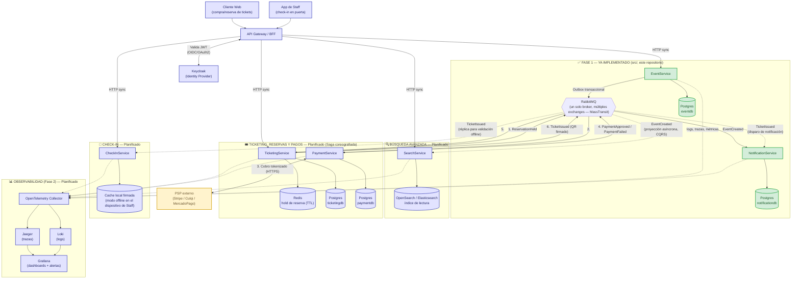

# Arquitectura de Sistema — Visión Completa a 6 Meses

**Audiencia**: equipo de ingeniería, arquitectura y stakeholders técnicos.
**Alcance**: este documento describe la arquitectura objetivo del sistema **completo** de venta/gestión de eventos con alta concurrencia, pagos, emisión de tickets QR, check-in, búsqueda avanzada y notificaciones multicanal (secciones 1–2 del reto técnico), tal como lo exige el diseño a 6 meses. El código en `src/` implementa hoy únicamente la **Fase 1** de esta visión — `EventService` y `NotificationService` — y ese código **no se modifica** en este documento; se toma como línea base ya construida sobre la cual el resto del sistema se proyecta.

**Fuentes de verdad**: `.specify/memory/constitution.md` (decisiones y restricciones ya fijadas para la Fase 1) y `specs/001-core-mvp-events-platform/` (spec, plan, contratos del MVP ya implementado).

---

## 1. Diagrama de Arquitectura (sistema completo a 6 meses)

**Cómo leer el diagrama**:
- 🟩 **Verde = ya implementado**: `EventService`, `NotificationService`, `eventdb`, `notificationdb` y el broker RabbitMQ con el contrato `EventCreated` existen hoy en `src/` y funcionan de punta a punta (ver `specs/001-core-mvp-events-platform/`).
- 🟦 **Azul = planificado**: todo lo demás (Gateway, Keycloak, `SearchService`, `TicketingService`, `PaymentService`, `CheckInService`, Observabilidad) es diseño a 6 meses, sin código todavía.
- 🟨 **Amarillo = externo**: el PSP es un sistema de terceros fuera del control de este equipo.
- Ningún microservicio llama a otro por HTTP — el único acoplamiento entre backends es RabbitMQ (regla no negociable heredada de la Fase 1, ver §4 y `constitution.md` §4).
- `NotificationService` y `CheckInService` **no reciben tráfico de negocio del Gateway** en el caso de `NotificationService` (es puro consumidor); `CheckInService` sí expone HTTP para el escaneo interactivo de Staff, pero también consume eventos para poder operar sin conexión (ver §3.6).

---

## 2. Componentes y Servicios Empleados

| Componente | Uso en el sistema | Justificación |
|---|---|---|
| **API Gateway / BFF** | Único punto de entrada HTTP para Cliente Web y App de Staff. Termina TLS, valida el JWT contra Keycloak, enruta a cada microservicio, y aplica rate limiting agregado (ver §5). | Con 4 servicios HTTP-facing (`EventService`, `SearchService`, `TicketingService`, `CheckInService`) en lugar de 1, centralizar TLS/CORS/rate-limiting perimetral evita duplicar esa configuración de seguridad en cada servicio y le da al cliente una única URL base estable aunque los servicios internos cambien. |
| **Keycloak (Identity Provider)** | Emisor y validador real de tokens OIDC/OAuth2; fuente de verdad de usuarios y roles (`Cliente`, `Promotor`, `Admin`, `Staff`). | Reemplaza el JWT local sin emisor de la Fase 1 (Constitución §5.1/§5.2), sin exigir cambios en las policies de autorización ya escritas — solo cambia el validador de token. |
| **RabbitMQ (Broker)** | Transporte único de comunicación entre backends, vía MassTransit. Un solo broker, múltiples exchanges/colas (uno por tipo de evento de integración). | Ya en producción en la Fase 1 con Outbox transaccional, reintentos y DLQ nativos — se reutiliza sin cambios de diseño para todos los eventos nuevos (`ReservationHeld`, `PaymentApproved`, `TicketIssued`, etc.). |
| **PostgreSQL — una base por servicio** (`eventdb`, `notificationdb`, `ticketingdb`, `paymentdb`) | Persistencia transaccional (ACID) de cada dominio de escritura. | Mantiene el principio *Database per Service* ya adoptado en la Fase 1 (Constitución §7.3): ningún servicio comparte esquema ni motor con otro, y cada uno migra su propio schema de forma independiente. |
| **OpenSearch / Elasticsearch (NoSQL — motor de búsqueda)** | Índice de solo lectura, alimentado por proyección asíncrona de eventos, que sirve la búsqueda avanzada de eventos (texto libre, filtros por categoría/fecha/ubicación/precio, relevancia). | **Por qué NoSQL y no Postgres para esto**: Postgres resuelve bien las transacciones de escritura del dominio `Event`, pero un motor de búsqueda de texto completo con *facetas*, *ranking* de relevancia y filtros combinados a alta concurrencia de lectura es un problema estructuralmente distinto — requiere índices invertidos, tokenización lingüística y agregaciones que Postgres solo soporta de forma parcial (`tsvector`) y sin el mismo desempeño ni capacidad de escalar horizontalmente el lado de lectura de forma independiente del lado de escritura. Usar un motor separado, alimentado por CQRS (proyección desde los mismos eventos de dominio), evita que la carga de búsqueda impacte el rendimiento transaccional de `EventService`. |
| **Redis — 3 usos distintos, no intercambiables** | 1) **Cache-Aside** en `EventService` (ya implementado, Fase 1): acelera lecturas de `GET /events`. 2) **Hold temporal de reserva** en `TicketingService` (planificado): contador/lock distribuido con TTL para bloquear cupo durante el checkout sin comprometer aún la base transaccional. 3) **Rate limiting distribuido** en el API Gateway (planificado): contador compartido entre las múltiples instancias del Gateway, complementando (no reemplazando) el rate limiting nativo de .NET 10 que corre localmente en cada servicio. | Los tres usos comparten la tecnología pero resuelven problemas distintos: uno es una optimización de lectura, el segundo es una estructura de datos con semántica de expiración crítica para el negocio (evitar sobreventa), y el tercero es un contador compartido entre procesos — mezclar esas responsabilidades en una sola instancia/base lógica de Redis sería un error de diseño; se documentan como 3 usos explícitos y, en producción, como bases lógicas (`db`/prefijo de clave) separadas dentro del mismo clúster de Redis. |
| **PSP externo** (Stripe / Culqi / MercadoPago, según mercado) | Procesa el cobro real; nuestro sistema nunca toca el número de tarjeta. | Ver §5 (cumplimiento de datos de pago). |
| **Stack de Observabilidad** (OpenTelemetry, Jaeger, Loki, Grafana) | Recolecta logs/trazas/métricas de **todos** los servicios (implementados y planificados) hacia un único lugar de diagnóstico. | Ver `constitution.md` §6 — la Fase 1 ya sienta la base (`correlationId`, logs estructurados, health checks) que esta capa instrumenta sin rediseñarla. |

---

## 3. Listado de Microservicios

### 3.1 EventService — ✅ Ya implementado

| Atributo | Detalle |
|---|---|
| **Responsabilidad** | Dueño exclusivo del agregado `Event`/`Zone`. Única fuente de verdad de qué eventos existen y sus zonas de precio/capacidad. |
| **Persistencia** | `eventdb` (Postgres), exclusiva. |
| **Comunicación** | HTTP síncrono con el cliente (vía Gateway). Publica `EventCreated` de forma asíncrona (Outbox transaccional) — nunca llama a otro servicio por HTTP. |
| **Estado** | Implementado y probado (39 pruebas automatizadas, ver `specs/001-core-mvp-events-platform/tasks.md`). |

### 3.2 NotificationService — ✅ Ya implementado

| Atributo | Detalle |
|---|---|
| **Responsabilidad** | Reaccionar de forma idempotente y resiliente a eventos de dominio de otros servicios; hoy simula un correo ante `EventCreated`, a 6 meses es el canal multicanal (email/SMS/push) que reacciona también a `TicketIssued`. |
| **Persistencia** | `notificationdb` (Postgres), tabla `AuditLog` como registro de auditoría de procesamiento. |
| **Comunicación** | 100% asíncrona — consume mensajes de RabbitMQ, no expone HTTP de negocio. |
| **Estado** | Implementado y probado. |

### 3.3 SearchService — Planificado

| Atributo | Detalle |
|---|---|
| **Responsabilidad** | Servir la búsqueda avanzada de eventos publicados (texto libre, filtros, relevancia) sin tocar la base transaccional de `EventService`. |
| **Motor de persistencia** | OpenSearch/Elasticsearch — ver justificación NoSQL en §2. No tiene base de datos transaccional propia: es una proyección de solo lectura, reconstruible desde el histórico de eventos si fuera necesario. |
| **Comunicación** | Lectura vía HTTP síncrono (Gateway → `SearchService`). Escritura de su índice **solo** vía consumo asíncrono de eventos (`EventCreated` y, a futuro, eventos de disponibilidad) — nunca recibe un `POST` directo de un cliente. |

### 3.4 TicketingService — Planificado

| Atributo | Detalle |
|---|---|
| **Responsabilidad** | Gestionar reservas y tickets bajo alta concurrencia, garantizando que nunca se venda más capacidad de la disponible por zona (anti-sobreventa). Orquesta (por coreografía, no por orquestador central) el flujo reserva → pago → emisión. |
| **Motor de persistencia** | Postgres (`ticketingdb`) para el estado durable de `Reservation`/`Ticket`; Redis como estructura auxiliar de corta vida para el hold de cupo (nunca como fuente de verdad — ver §6.4). |
| **Comunicación** | HTTP síncrono para crear una reserva (el cliente espera confirmación inmediata del hold). Asíncrono (MassTransit) para todo lo que sigue: confirmar o liberar la reserva según el resultado del pago. |

### 3.5 PaymentService — Planificado

| Atributo | Detalle |
|---|---|
| **Responsabilidad** | Procesar el cobro contra el PSP externo y ser la única fuente de verdad de si un pago fue aprobado, rechazado o revertido. |
| **Motor de persistencia** | Postgres (`paymentdb`) — registro transaccional de intentos de pago y su estado, con el identificador del PSP como referencia externa (nunca datos de tarjeta). |
| **Comunicación** | HTTP síncrono hacia el PSP externo (server-to-server, con el SDK oficial del proveedor). Asíncrono (MassTransit) hacia/desde el resto del sistema: consume `ReservationHeld`, publica `PaymentApproved`/`PaymentFailed`. |

### 3.6 CheckInService — Planificado

| Atributo | Detalle |
|---|---|
| **Responsabilidad** | Validar tickets QR en la puerta del evento, tanto online (contra el backend) como **offline** (sin conectividad en el recinto). |
| **Motor de persistencia** | Postgres compartiendo el criterio de `ticketingdb` para el estado canónico (online); una cache local firmada criptográficamente en el dispositivo de Staff (descargada antes del evento) para el modo offline. |
| **Comunicación** | HTTP síncrono para el escaneo interactivo cuando hay conectividad. Consume `TicketIssued` de forma asíncrona para mantener actualizada la réplica local que permite validar sin conexión — el único servicio de este diseño que combina ambos estilos de entrada de datos por una razón operativa real (el recinto de un evento masivo no siempre tiene buena señal). |

---

## 4. Flujos: Síncrono (HTTP) vs. Asíncrono (Eventos)

### 4.1 Flujo síncrono (HTTP) — Cliente/Staff ↔ Gateway ↔ un servicio

- **Cuándo se usa**: cuando quien llama necesita una respuesta inmediata para decidir su siguiente paso — crear una reserva y saber si hay cupo, o escanear un ticket y saber al instante si es válido.
- **Regla de oro**: el Gateway solo enruta hacia el servicio dueño del recurso solicitado. **Nunca** un microservicio de negocio llama HTTP a otro microservicio de negocio — ni siquiera a través del Gateway.

### 4.2 Flujo asíncrono (eventos, vía MassTransit) — siempre entre backends

- **Cuándo se usa**: toda comunicación entre servicios backend, sin excepción. Es la misma regla no negociable de la Fase 1 (Constitución §4), extendida a los 4 servicios nuevos.
- **Por qué se mantiene aunque el sistema crezca**: si `TicketingService` llamara por HTTP a `PaymentService` para cobrar, la disponibilidad de la venta de tickets quedaría atada a la disponibilidad del PSP y de `PaymentService` en tiempo real — exactamente el acoplamiento que este sistema evita desde la Fase 1.

### 4.3 Ejemplo de punta a punta: reserva → pago → emisión de ticket → notificación

1. **Cliente Web** → `POST /reservations` (HTTP sync, vía Gateway) → `TicketingService` valida cupo, coloca un **hold en Redis** (TTL, ej. 10 minutos) y responde `201` de inmediato — el cliente ya sabe que "apartó" su lugar.
2. `TicketingService` publica `ReservationHeld` (async) → `PaymentService` lo consume y **inicia el cobro contra el PSP** (HTTP síncrono, pero hacia un sistema externo, no entre microservicios propios).
3. `PaymentService` persiste el resultado en `paymentdb` y publica `PaymentApproved` o `PaymentFailed` (async).
4. `TicketingService` consume ese evento:
   - Si `PaymentApproved`: confirma la reserva (con **concurrencia optimista** contra `ticketingdb`, ver §6.4), genera el/los `Ticket` con QR firmado, y publica `TicketIssued`.
   - Si `PaymentFailed` (o el hold expira sin pago): libera el cupo — el TTL de Redis es, además, la red de seguridad si el evento de fallo se perdiera.
5. `TicketIssued` (async) llega en paralelo a **dos** consumidores independientes, cada uno sin saber del otro:
   - `NotificationService`: envía la notificación multicanal con el ticket al cliente.
   - `CheckInService`: actualiza su réplica local, para que ese ticket ya sea validable en la puerta del evento aunque el dispositivo de Staff pierda conectividad después.

Ningún paso de este flujo requiere que el cliente mantenga la conexión HTTP abierta más allá del paso 1 — el resto ocurre de forma desacoplada, exactamente el mismo principio que ya opera en la Fase 1 entre `EventService` y `NotificationService`.

---

## 5. Notas de Seguridad

| Control | Diseño a 6 meses |
|---|---|
| **Autenticación** | JWT emitido y validado vía **Keycloak** (OIDC/OAuth2): Authorization Code para Cliente Web y App de Staff, Client Credentials para integraciones servicio-a-servicio si las hubiera. El Gateway valida el token una sola vez y lo reenvía; ningún microservicio vuelve a contactar a Keycloak por request. |
| **Roles** | Cuatro roles en Keycloak, cada uno con un alcance claro de autorización: **Cliente** (compra/reserva tickets, ve únicamente sus propios tickets/reservas), **Promotor** (crea y gestiona únicamente los eventos que le pertenecen), **Admin** (control total de la plataforma), **Staff** (opera exclusivamente `CheckInService`; no ve datos de pago ni puede crear eventos). Las policies de autorización se siguen nombrando de forma agnóstica al proveedor, como ya se hizo en la Fase 1. |
| **Rate limiting** | Dos capas, no una: **rate limiting nativo de .NET 10** (`AddRateLimiter`, ya implementado en `EventService`) corriendo localmente en cada servicio como defensa de base, **más** un rate limiting **distribuido en el Gateway** (contador compartido en Redis, por usuario autenticado y no solo por IP) para detectar abuso agregado entre múltiples instancias y múltiples endpoints. |
| **Prevención de IDOR** | A diferencia de la Fase 1 (donde no aplicaba por no existir datos "por usuario"), en el sistema completo **sí existen** recursos con dueño: tickets/reservas de un Cliente, eventos de un Promotor. Regla de diseño no negociable: todo endpoint que devuelva o modifique un recurso con dueño debe validar que el `sub` del token coincida con el `ownerId` almacenado en el registro — nunca basta con que el token sea válido y el recurso exista. |
| **Manejo seguro de errores** | Se extiende sin cambios el patrón ya implementado en la Fase 1: middleware/`IExceptionHandler` que traduce cualquier excepción no controlada a un `ProblemDetails` genérico, nunca con stack trace, mensaje de excepción real ni detalle de conexión a datos. |
| **Cumplimiento de datos de pago** | **Tokenización delegada 100% al PSP**: el Frontend usa el SDK/Elements del PSP directamente en el navegador del cliente para tokenizar la tarjeta; nuestro backend (`PaymentService`) solo recibe y persiste el token/identificador de transacción que el PSP devuelve — **nunca** el número de tarjeta, CVV ni fecha de expiración pasan por nuestra infraestructura. Esto reduce el alcance de cumplimiento PCI-DSS de nuestro sistema al nivel más bajo (SAQ A/A-EP) en lugar de tener que certificar el manejo directo de datos de tarjeta (SAQ D). |

---

## 6. Sustentación de Decisiones Arquitectónicas

### 6.1 Clean Architecture (+ DDD táctico básico)

Cada servicio — implementado o planificado — sigue las mismas 4 capas concéntricas (`Domain` ← `Application` ← `Infrastructure` ← `Api`/`Worker`), ya validadas en `EventService`/`NotificationService`. La lógica de negocio no conoce el framework web, el ORM ni el broker, lo que permite que decisiones de infraestructura (cambiar de PSP, migrar de RabbitMQ a otro broker, reemplazar Redis) se resuelvan en la capa `Infrastructure` sin tocar `Domain` ni `Application`. Deliberadamente **no** se introducen patrones adicionales (Value Objects exhaustivos, Specification pattern, un bus de eventos de dominio interno) salvo que un requisito real los justifique — la complejidad se agrega cuando el problema la exige, no por anticipación.

### 6.2 Patrón Transactional Outbox

Ya implementado en `EventService` (Fase 1) y **obligatorio en todo servicio que publique eventos** (`TicketingService`, `PaymentService`) por la misma razón: sin persistir el mensaje saliente en la misma transacción que el cambio de estado de negocio, existen exactamente dos fallos posibles — publicar un evento para un cambio que finalmente no se confirmó, o confirmar un cambio que nadie llega a notificar. El Outbox elimina esa ventana de inconsistencia por diseño.

### 6.3 MassTransit como abstracción de mensajería

Se reutiliza en todos los servicios nuevos sin cambios de versión ni de patrón respecto a la Fase 1: reintentos, DLQ y el propio Outbox son funcionalidad de la librería, no código propio a mantener. **Nota de licenciamiento ya resuelta en la Fase 1** (y que aplica igual a todo servicio nuevo): se fija la versión en **8.5.10** (Apache 2.0) en todo el sistema, tras verificarse que MassTransit v9 introdujo un requisito de licencia comercial incompatible con la restricción de este proyecto de usar solo librerías OSS/gratuitas.

### 6.4 Control de concurrencia optimista + hold con TTL en Redis (anti-sobreventa)

**Problema**: bajo alta concurrencia (una venta de tickets tipo "flash sale", con miles de clientes intentando reservar el mismo cupo limitado en segundos), bloquear filas de Postgres durante todo el tiempo que un cliente tarda en pagar (que puede ser minutos) generaría contención masiva y throughput inaceptable.

**Decisión**: el cupo se "aparta" primero con una operación **atómica y de corta duración** en Redis (decremento condicional con TTL) — rápida, no bloqueante para otros clientes, y que se auto-revierte sola si el cliente abandona el pago. Solo en el momento de la **confirmación definitiva** (tras `PaymentApproved`) se toca Postgres, con **concurrencia optimista** (un token de versión/`xmin` en la fila de disponibilidad) como red de seguridad final ante la — improbable pero posible — carrera entre dos confirmaciones casi simultáneas en el borde de expiración del TTL.

**Por qué esta combinación y no una sola técnica**: Redis solo, sin la verificación optimista final en Postgres, sería una fuente de verdad "blanda" (podría perder el hold por un fallo de infraestructura sin que nadie se entere). Postgres solo, sin el hold en Redis, obligaría a mantener transacciones abiertas durante todo el ciclo de pago. La combinación da alto throughput en el momento de mayor contención (el hold) sin sacrificar la garantía dura de "nunca vender de más" (la confirmación).

### 6.5 Patrón Saga (coreografía de eventos) entre TicketingService y PaymentService

**Problema**: la reserva de un ticket y el cobro de su pago viven en dos bases de datos distintas (`ticketingdb`, `paymentdb`), y el paso intermedio depende además de un sistema externo (el PSP) que **no puede participar** en ninguna transacción distribuida de nuestro sistema.

**Decisión**: en lugar de una transacción distribuida (2PC) — técnicamente inviable en cuanto el PSP entra en el flujo, y de por sí indeseable entre bases de datos que queremos mantener autónomas (Database per Service) — se modela el flujo como una **Saga coreografiada**: cada servicio reacciona a eventos publicados por el otro, sin un orquestador central que conozca el flujo completo. `TicketingService` no sabe cómo `PaymentService` cobra, ni `PaymentService` sabe qué hace `TicketingService` con el resultado — cada uno solo conoce el contrato del evento que consume y el que publica.

**Por qué coreografía y no un orquestador central**: con solo dos pasos (reservar → cobrar → confirmar/liberar), un orquestador central añadiría un componente adicional a mantener y un punto único de fallo para coordinar un flujo que los propios eventos ya coordinan de forma natural. Si el flujo creciera a muchos más pasos (por ejemplo, incorporando validaciones de fraude, cupones, facturación electrónica), la coreografía se volvería difícil de seguir y sería el momento correcto de introducir un orquestador (ej. una máquina de estados explícita) — una decisión que este documento deja señalada para revisarse si el flujo crece, no una que se toma preventivamente hoy.
