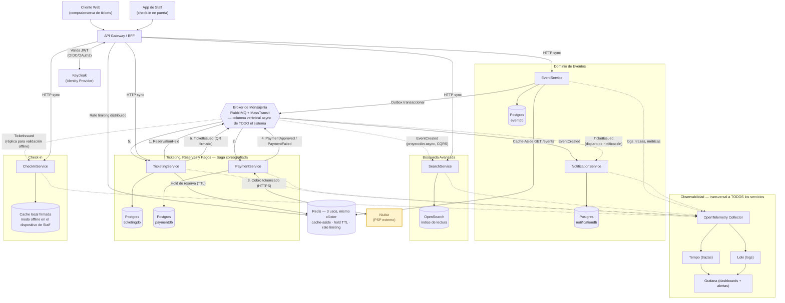
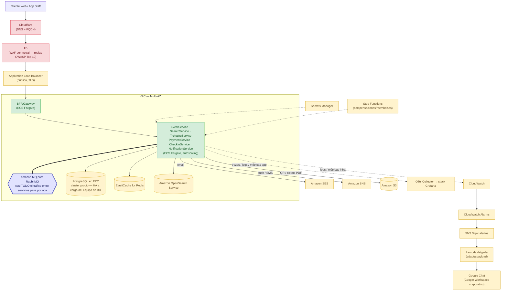

# Arquitectura de Sistema — Visión Completa a 6 Meses

**Audiencia**: equipo de ingeniería, arquitectura y stakeholders técnicos.
**Alcance**: arquitectura teórica de una plataforma de venta/gestión de eventos con alta concurrencia, pagos, tickets QR, check-in, búsqueda avanzada y notificaciones, para una primera versión productiva en 6 meses. Cubre la **arquitectura lógica** (§1–4, agnóstica de proveedor) y su **mapeo a AWS/híbrido** (§1.1). Para equipo, sprints y entornos ver [`roadmap.md`](./roadmap.md).

---

## 1. Diagrama de Arquitectura

**Lectura rápida**: Niubiz (🟨) es el único sistema externo. El broker (hexágono central) es la columna vertebral async — ningún microservicio llama a otro por HTTP, solo a través de él (§4). `NotificationService` es puro consumidor; `CheckInService` combina HTTP (escaneo en puerta) y eventos (réplica offline).

---

## 1.1 Vista de Despliegue en AWS

**Decisión**: cómputo, mensajería y datos en AWS; perímetro (DNS y WAF) con los proveedores ya estándar de la empresa (Cloudflare, F5); base de datos operada directamente por el Equipo de BD sobre EC2, no como servicio administrado. Es, por diseño, un despliegue **multi-proveedor/híbrido** — no "100% AWS" — sin que eso cambie la arquitectura lógica (§1).

**Mapeo componente → AWS**:

| Componente | Servicio AWS | Por qué |
|---|---|---|
| API Gateway / BFF | ALB → BFF en ECS Fargate | JWT y rate limiting ya se resuelven en código .NET; Amazon API Gateway solo si aparecen integraciones B2B con usage plans. |
| Cada microservicio | ECS Fargate, autoscaling por CPU y profundidad de cola | Sin servidores que parchear; menor costo operativo que un EKS propio para este equipo. |
| Broker de mensajería | **Amazon MQ para RabbitMQ** — el componente más central, no uno más | Mantiene MassTransit (Outbox/DLQ/retry de fábrica, §6.3) sin reescribirlo contra SNS+SQS; AWS solo opera el broker. |
| PostgreSQL por servicio | **EC2** (self-managed), no RDS | El Equipo de BD ya opera y prefiere administrar Postgres directamente (replicación/failover propios) en vez de un servicio administrado. |
| OpenSearch | Amazon OpenSearch Service | Administrado, sin clúster propio. |
| Redis | ElastiCache | Los 3 usos lógicos (§2) van en namespaces separados del mismo clúster. |
| Auditoría centralizada | DynamoDB + export a S3/Glacier | Ver §6.9. |
| Notificaciones | SES (email) + SNS (push/SMS) | Ver §6.8. |
| Pasarela de pago | Niubiz (SaaS externo) | Único proveedor — ver §6.12. |
| Tickets QR / comprobantes | S3 | URL firmada, nunca servido por el propio microservicio. |
| Identidad | Keycloak self-hosted en ECS Fargate + Postgres propio (mismo clúster EC2) | No hay Keycloak administrado nativo en AWS. |
| Observabilidad | CloudWatch (infra) + stack Grafana (app) | Ver §6.6. |
| Alertas | CloudWatch Alarms → SNS → Lambda → Google Chat (infra); Grafana Alerting (SLOs de app) | Ver §6.7. |
| Compensaciones/reembolsos | Step Functions | Ver §6.11. |
| Secretos | Secrets Manager con rotación | Nada en variables de entorno ni en el repo. |
| DNS / dominio | **Cloudflare** | FQDN y gestión de DNS — estándar ya adoptado por la empresa, fuera de Route 53. |
| WAF perimetral | **F5** | Estándar de seguridad ya adoptado por la empresa; reglas alineadas a **OWASP Top 10** — ver §5. |

**Detalle técnico** (proveedor · tecnología · puerto):

| Componente | Proveedor | Tecnología | Puerto |
|---|---|---|---|
| API Gateway / BFF | AWS ECS Fargate | C#/.NET 10, ASP.NET Core (YARP) | 443 (ALB) → 8080 |
| Keycloak | Self-hosted (ECS Fargate) | Keycloak 25.x (Quarkus) | 8080 / 8443 |
| Broker de mensajería | Amazon MQ | RabbitMQ 3.13 + MassTransit 8.5.10 | 5672 / 15672 (UI) |
| Base transaccional | EC2 (self-managed, Equipo de BD) | PostgreSQL 16 + Patroni/repmgr (HA) | 5432 |
| Búsqueda | OpenSearch Service | OpenSearch 2.x | 9200 |
| Caché / hold / rate limit | ElastiCache | Redis 7.x | 6379 |
| DNS / dominio | Cloudflare | DNS + FQDN | 53 / 443 |
| WAF perimetral | F5 | F5 Advanced WAF / BIG-IP, reglas OWASP Top 10 | 443 |
| Auditoría | DynamoDB | — | API HTTPS |
| Notificaciones | SES / SNS | — | API HTTPS |
| Pasarela de pago | Niubiz (SaaS externo) | API REST de Niubiz (tokenización + autorización) | 443 saliente |
| Observabilidad (app) | OSS en EKS o Grafana Cloud | OTel Collector + Tempo + Loki + Mimir + Grafana 11.x | 3000 / 3200 / 3100 / 9090 |
| Observabilidad (infra) | CloudWatch | — | API HTTPS |
| Compensaciones | Step Functions | — | API HTTPS |
| Secretos | Secrets Manager | — | API HTTPS |

**Variante híbrida adicional**: si además hace falta federar contra un Active Directory corporativo que no puede salir de la red interna, Keycloak se despliega on-prem y expone su endpoint OIDC vía VPN Site-to-Site/Direct Connect — el resto del cómputo no tiene hoy razón de negocio para salir de AWS.

---

## 2. Componentes y Servicios Empleados

| Componente | Uso | Por qué |
|---|---|---|
| **API Gateway / BFF** | Único punto de entrada HTTP; termina TLS, valida JWT, enruta, aplica rate limiting agregado. | Evita duplicar TLS/CORS/rate-limiting en 4 servicios HTTP-facing distintos. |
| **Keycloak** | Emisor/validador OIDC/OAuth2; fuente de verdad de usuarios y roles. | Policies de autorización agnósticas al proveedor de identidad. |
| **Broker (RabbitMQ + MassTransit)** | Transporte único entre backends — el componente por el que pasa casi toda la comunicación interna. | Outbox, reintentos y DLQ de fábrica cubren todos los eventos con un solo diseño (§6.2/6.3). |
| **PostgreSQL — una base por servicio** | Persistencia transaccional (ACID) por dominio. | *Database per Service*: nada de esquema compartido. |
| **OpenSearch (NoSQL)** | Índice de solo lectura para búsqueda avanzada, alimentado por proyección async. | Postgres no rinde igual en texto completo + facetas + relevancia a alta concurrencia de lectura; separar el índice aísla esa carga del lado transaccional. |
| **Redis — 3 usos, no intercambiables** | Cache-Aside (`EventService`), hold de reserva con TTL (`TicketingService`), rate limiting distribuido (Gateway). | Mismo motor, problemas distintos — se documentan y se aíslan como namespaces separados. |
| **Niubiz** | Procesa el cobro; el sistema nunca toca el número de tarjeta. | Único proveedor — ver §6.12. |
| **Stack de Observabilidad** | Logs/trazas/métricas de todos los servicios en un solo lugar. | Ver §6.6. |

Detalle de proveedor/tecnología/puerto de cada pieza: tabla en §1.1.

---

## 3. Listado de Microservicios

### 3.1 EventService

| Atributo | Detalle |
|---|---|
| Responsabilidad | Dueño del agregado `Event`/`Zone`. |
| Persistencia | `eventdb` (Postgres), exclusiva. |
| Comunicación | HTTP sync con el cliente; publica `EventCreated` async (Outbox). |
| Tecnología | C#/.NET 10 — ASP.NET Core (Minimal APIs) + MassTransit |
| Puerto | `8080` |
| Hosting | ECS Fargate |

### 3.2 NotificationService

| Atributo | Detalle |
|---|---|
| Responsabilidad | Reacciona idempotentemente a `EventCreated` y, a 6 meses, `TicketIssued` (email/SMS/push). |
| Persistencia | `notificationdb`, tabla `AuditLog`. |
| Comunicación | 100% async — consumidor puro, sin HTTP de negocio. |
| Tecnología | C#/.NET 10 — Worker Service + MassTransit |
| Puerto | Sin HTTP de negocio (`8081` solo health check) |
| Hosting | ECS Fargate |

### 3.3 SearchService

| Atributo | Detalle |
|---|---|
| Responsabilidad | Búsqueda avanzada de eventos publicados sin tocar la base de `EventService`. |
| Persistencia | OpenSearch — proyección de solo lectura, reconstruible. |
| Comunicación | Lectura HTTP sync; escritura de índice solo vía eventos async. |
| Tecnología | C#/.NET 10 — ASP.NET Core (Minimal APIs) + cliente OpenSearch + MassTransit |
| Puerto | `8080` |
| Hosting | ECS Fargate |

### 3.4 TicketingService

| Atributo | Detalle |
|---|---|
| Responsabilidad | Reservas/tickets bajo alta concurrencia, anti-sobreventa; coreografía reserva → pago → emisión. |
| Persistencia | `ticketingdb` (Postgres); Redis para el hold de cupo (nunca fuente de verdad, §6.4). |
| Comunicación | HTTP sync para crear reserva; async para el resto. |
| Tecnología | C#/.NET 10 — ASP.NET Core (Minimal APIs) + MassTransit + `StackExchange.Redis` |
| Puerto | `8080` |
| Hosting | ECS Fargate, autoscaling más agresivo (mayor pico de carga del sistema) |

### 3.5 PaymentService

| Atributo | Detalle |
|---|---|
| Responsabilidad | Cobra contra Niubiz; única fuente de verdad del estado del pago. |
| Persistencia | `paymentdb` — número de operación/autorización de Niubiz como referencia externa (nunca datos de tarjeta) + tabla Inbox de callbacks recibidos (ver §6.13). |
| Comunicación | HTTP sync hacia Niubiz (OAuth2 Client Credentials) para tokenización/autorización; expone además un **callback propio** para la confirmación async del pago (ver §6.13 — proceso crítico); async con el resto del sistema vía MassTransit. |
| Tecnología | C#/.NET 10 — ASP.NET Core (Minimal APIs) + cliente HTTP para la API de Niubiz + MassTransit |
| Puerto | `8080` |
| Hosting | ECS Fargate |

### 3.6 CheckInService

| Atributo | Detalle |
|---|---|
| Responsabilidad | Valida tickets QR en puerta, online y **offline**. |
| Persistencia | Postgres para estado canónico; cache local firmada en el dispositivo de Staff para offline. |
| Comunicación | HTTP sync para el escaneo; consume `TicketIssued` async para mantener la réplica offline. |
| Tecnología | C#/.NET 10 — ASP.NET Core (Minimal APIs) + MassTransit |
| Puerto | `8080` |
| Hosting | ECS Fargate |

---

## 4. Flujos: Síncrono (HTTP) vs. Asíncrono (Eventos)

**HTTP (síncrono)**: solo cuando quien llama necesita una respuesta inmediata para decidir su siguiente paso (crear una reserva, escanear un ticket). El Gateway solo enruta al servicio dueño del recurso — nunca un microservicio llama HTTP a otro.

**Eventos (asíncrono, vía MassTransit)**: toda comunicación entre backends, sin excepción. Si `TicketingService` llamara HTTP a `PaymentService`, la venta de tickets quedaría atada a la disponibilidad de Niubiz en tiempo real.

**Ejemplo de punta a punta — reserva → pago → ticket → notificación**:

1. `POST /reservations` (HTTP) → `TicketingService` coloca **hold en Redis** (TTL) y responde `201` de inmediato.
2. Publica `ReservationHeld` (async) → `PaymentService` cobra contra **Niubiz** (HTTP hacia el externo).
3. `PaymentService` persiste el resultado y publica `PaymentApproved`/`PaymentFailed` (async).
4. `TicketingService` consume ese evento: si aprobado, confirma con **concurrencia optimista** (§6.4) y publica `TicketIssued`; si falla o expira, libera el cupo.
5. `TicketIssued` llega en paralelo a `NotificationService` (notifica al cliente) y `CheckInService` (actualiza su réplica offline).

Ningún paso requiere que el cliente mantenga la conexión abierta más allá del paso 1.

---

## 5. Notas de Seguridad

| Control | Diseño |
|---|---|
| **Autenticación** | JWT vía Keycloak (OIDC/OAuth2): Authorization Code para Cliente/Staff, Client Credentials entre servicios si aplica. El Gateway valida una sola vez. |
| **Login social (Google)** | Keycloak federa Google como IdP externo para el rol Cliente — sigue siendo Keycloak el único emisor del JWT. |
| **Niubiz — llamadas salientes** | **OAuth 2.0 Client Credentials**: `PaymentService` obtiene un access token del authorization server de Niubiz (server-to-server, sin compartir ninguna contraseña) y lo usa como Bearer en cada llamada. `client_id`/`client_secret` en Secrets Manager, rotación manual. |
| **Niubiz — callback entrante (confirmación de pago)** | Endpoint propio que compartimos con Niubiz, con validación de formato, firma/IP allowlist, idempotencia y persistencia Inbox — es el punto de entrada más sensible del sistema (dinero real). Detalle completo en §6.13. |
| **Roles** | Cliente, Promotor, Admin, Staff — cada uno con alcance claro; policies agnósticas al proveedor de identidad. |
| **Rate limiting** | Dos capas: nativo de .NET 10 (`AddRateLimiter`) por servicio + distribuido en Redis a nivel Gateway (por usuario, no solo IP). |
| **Prevención de IDOR** | Todo endpoint que devuelva/modifique un recurso con dueño (ticket, reserva, evento) valida `sub` del token contra el `ownerId` — nunca basta con que el token sea válido. |
| **Manejo de errores** | `IExceptionHandler` único por servicio → `ProblemDetails` genérico, sin stack trace ni detalle interno. |
| **Cumplimiento de pago** | Tokenización 100% en el checkout de Niubiz; el backend solo persiste el número de operación/autorización. Reduce el alcance PCI-DSS a SAQ A. |
| **Estándar de seguridad aplicativo** | **OWASP Top 10** como checklist de referencia: reglas del WAF (F5) mapeadas a sus categorías (Injection, Broken Access Control, Broken Auth, etc.) y revisión obligatoria en cada PR/release de Seguridad y QA. |

---

## 6. Sustentación de Decisiones Arquitectónicas

**6.1 Clean Architecture (+ DDD táctico básico)**: 4 capas concéntricas (`Domain` ← `Application` ← `Infrastructure` ← `Api`/`Worker`) en todos los servicios; cambiar PSP, broker o caché se resuelve en `Infrastructure` sin tocar el dominio. Sin patrones adicionales salvo que un requisito real los justifique.

**6.2 Transactional Outbox**: obligatorio en todo servicio que publique eventos. Sin persistir el mensaje saliente en la misma transacción del cambio de estado, hay dos fallos posibles: publicar un evento de algo que no se confirmó, o confirmar algo que nadie notifica.

**6.3 MassTransit**: misma versión y patrón en todo el sistema — reintentos, DLQ y Outbox son de la librería, no código propio. Se fija **8.5.10** (Apache 2.0): la v9 exige licencia comercial, incompatible con usar solo OSS/gratuito.

**6.4 Concurrencia optimista + hold TTL en Redis (anti-sobreventa)**: bloquear filas de Postgres durante todo el checkout (minutos) generaría contención inaceptable en una flash sale. El cupo se aparta primero en Redis (atómico, TTL, se auto-revierte) y solo se confirma en Postgres con concurrencia optimista tras `PaymentApproved` — Redis da throughput en el pico, Postgres da la garantía dura de "nunca vender de más".

**6.5 Saga coreografiada (Ticketing ↔ Payment)**: la reserva y el cobro viven en bases distintas, y Niubiz no puede participar en una transacción distribuida. Cada servicio reacciona a eventos del otro sin orquestador central — con solo 2 pasos (reservar → cobrar), un orquestador sería un componente y un punto de fallo de más. Si el flujo creciera (fraude, cupones, facturación), ahí sí valdría introducir uno.

**6.6 Observabilidad — CloudWatch + stack Grafana, no uno solo**: CloudWatch para lo que AWS ya expone gratis (ALB/EC2/ElastiCache/ECS); stack Grafana (OTel → Tempo/Loki/Mimir) para trazas distribuidas y dashboards de negocio, portable dado que el despliegue ya es multi-proveedor (§1.1). Reconstruir en Grafana lo que CloudWatch ya da gratis sería trabajo redundante.

**6.7 Alertas — dos rutas, con Google Chat como destino**: CloudWatch Alarms → SNS → Lambda → **Google Chat** (Google Workspace corporativo) para infraestructura; Grafana Alerting (soporte nativo de Google Chat) para SLOs de negocio. Se necesita una Lambda intermedia porque AWS Chatbot solo integra nativamente con Slack/Teams, no con Google Chat. Dos rutas porque son audiencias distintas: Plataforma resuelve una alarma de CPU, Desarrollo resuelve una de tasa de pagos fallidos.

**6.8 Notificaciones — SES + SNS**: SES para email transaccional, SNS para push/SMS, ambos nativos de AWS. Se implementan detrás de la misma interfaz `IEmailSender`/`INotificationSender` de `NotificationService`, para poder sumar o cambiar de proveedor sin tocar el dominio.

**6.9 Auditoría centralizada — DynamoDB**: cada servicio ya audita su propia idempotencia en su propia base (ej. `notificationdb.AuditLog`), pero Seguridad necesita un rastro transversal (quién hizo qué, cuándo) sin acceso a cada base transaccional. DynamoDB encaja porque el patrón es append-only + lectura por clave, sin joins, y el esquema de cada evento varía por servicio de origen — forzarlo a una tabla relacional única sería peor. Retención larga vía export a S3.

**6.10 Cache-Aside en Redis, sin CDN de por medio**: Redis cachea la respuesta de un endpoint con invalidación explícita en escritura, resolviendo la carga repetida sobre Postgres (ej. `GET /events`). Se descarta una CDN (CloudFront): el volumen actual no justifica esa capa adicional de invalidación, y el catálogo de eventos cambia con la frecuencia suficiente para que aporte poco sobre lo que ya resuelve Redis. Si el tráfico público creciera con usuarios muy distribuidos geográficamente, Cloudflare (ya presente en el perímetro, §1.1) puede habilitar cacheo de borde sin sumar un proveedor más.

**6.11 Alta disponibilidad vs. Step Functions**: la disponibilidad se resuelve con redundancia (Postgres en EC2 con replicación streaming + failover gestionado por el Equipo de BD, ElastiCache con réplicas, Amazon MQ activo-standby, ECS con 2+ tareas en 2+ AZ, autoscaling por cola) — nada de eso necesita Step Functions. Step Functions sirve para **orquestar compensaciones** (reembolsos, cancelación de evento con reversión multi-paso), donde sí hacen falta pasos, reintentos con backoff y esperas largas auditables. La Saga coreografiada de §6.5 sigue siendo correcta para el flujo feliz.

**6.12 Un solo proveedor de pago — Niubiz**: mantener varios PSP a la vez multiplica integración, formatos de notificación y superficie de auditoría PCI, sin que el reto lo exija. Niubiz (ex-VisaNet, procesador líder en el mercado peruano): integración vía su API REST de tokenización + autorización, checkout propio que mantiene el número de tarjeta fuera de nuestra infraestructura (PCI SAQ A), y soporte directo de medios de pago y moneda locales.

**6.13 Procesamiento de pagos — el proceso más crítico del sistema**

El cobro tiene dos puntos de entrada al sistema, no uno: la llamada saliente que inicia el pago (§4.3), y el **callback de confirmación** que Niubiz invoca sobre un endpoint que nosotros exponemos y les compartimos (`POST /payments/callbacks/niubiz`). Por ser un endpoint público, invocado por un tercero, con dinero real de por medio, es el que más blindaje necesita de todo el sistema:

- **Autenticación saliente (OAuth 2.0)**: ver §5 — Client Credentials, sin contraseñas compartidas. Para el callback *entrante* la lógica es inversa: es Niubiz quien debe demostrarnos que es quien dice ser, no nosotros a ellos — por eso el callback no usa OAuth2, usa las capas de abajo.
- **Validación de formato**: el callback se deserializa contra un contrato estricto (id de operación, estado, monto, moneda, timestamp); cualquier payload que no calce se rechaza con `400` antes de tocar lógica de negocio.
- **Seguridad, en capas**: (1) solo HTTPS; (2) F5 restringe el origen a los rangos de IP que Niubiz publique para sus callbacks; (3) firma/secreto compartido específico de esta integración — **a confirmar con Niubiz en la integración técnica**, junto con su mecanismo real de notificación; (4) el monto/moneda del callback se contrastan contra lo ya registrado en `paymentdb` para esa operación — un callback que declare "aprobado" con un monto distinto al cobrado se rechaza, nunca se asume válido por venir de una IP conocida.
- **Idempotencia**: mismo patrón que el consumidor idempotente de `NotificationService` — el id de operación de Niubiz es la clave, con **constraint único** en la tabla Inbox de `paymentdb`. Si el callback ya fue procesado, se responde `200` sin reprocesar ni republicar el evento — necesario porque el mismo callback puede llegar más de una vez (reintento del proveedor, reintento de red, doble clic del usuario).
- **Persistencia (patrón Inbox)**: el callback crudo se persiste primero —junto con el constraint único— *antes* de cualquier efecto de negocio, simétrico al Outbox de publicación (§6.2). Así queda evidencia para reconciliar aunque el procesamiento posterior falle, y el `200` se responde apenas el registro es durable, no al final de la cadena de efectos.
- **Reintentos, en dos direcciones**:
  - *Niubiz → nosotros*: si el callback nunca llega, no hay que depender solo de él. Se agrega un **job de reconciliación** que consulta periódicamente el estado de todo pago que siga "pendiente" más allá de un umbral, contra el endpoint de consulta de Niubiz. **Pendiente de confirmar con Niubiz**: si reintentan el callback, con qué backoff y cuántas veces — hasta entonces se diseña asumiendo el peor caso (no reintentan).
  - *Nosotros → el resto del sistema*: una vez procesado el callback, publicar `PaymentApproved`/`PaymentFailed` usa el Outbox + reintentos/DLQ de MassTransit ya establecidos (§6.2/6.3) — ninguna maquinaria nueva ahí.

**6.14 Riesgo de doble check-in en modo offline (no se puede eliminar del todo)**

**El problema real**: si dos puertas distintas (o dos dispositivos de Staff) están **ambas sin conexión** al mismo tiempo, cada una valida el mismo QR contra su propia "foto" local — ninguna sabe que la otra ya lo marcó como usado hasta que ambas vuelvan a sincronizar con el backend. Es decir: **si hay dos puertas sin señal a la vez, dos personas distintas pueden entrar con el mismo ticket**. Ningún diseño puramente offline puede evitar esto sin coordinación en tiempo real entre dispositivos — es el mismo trade-off de fondo que CAP: no se puede tener disponibilidad offline total y consistencia (un ticket, una entrada) garantizada al mismo tiempo, sin red.

**Mitigaciones (reducen la ventana de riesgo, no la eliminan)**:
- **Online siempre primero, con timeout corto** (1–2s): la validación en tiempo real contra el backend es la fuente de verdad real y detecta el duplicado al instante; el modo offline es el último recurso, no el camino por defecto — así la ventana de riesgo se reduce a cortes de red genuinos, no a wifi lento.
- **Sincronización oportunista**: el dispositivo sincroniza apenas detecta cualquier señal, aunque sea intermitente — no espera una conexión estable, para propagar "usado" entre puertas lo antes posible.
- **Reconciliación post-evento**: al sincronizar, el backend detecta si el mismo ticket fue marcado "usado" en más de un dispositivo y lo deja **marcado para revisión de Seguridad** — no previene la entrada duplicada, pero la hace visible y auditable.
- **Partición de puertas** (operativo, no técnico): si el evento lo permite, asignar rangos/sectores de tickets distintos a cada puerta reduce la probabilidad de que el mismo ticket se presente en dos puertas a la vez.

Esto queda documentado como **riesgo aceptado bajo corte total de conectividad**, no como un defecto a corregir con más código — la mitigación real, más allá de estas capas, es de infraestructura del recinto (mejor señal en el venue), no de arquitectura de software.
